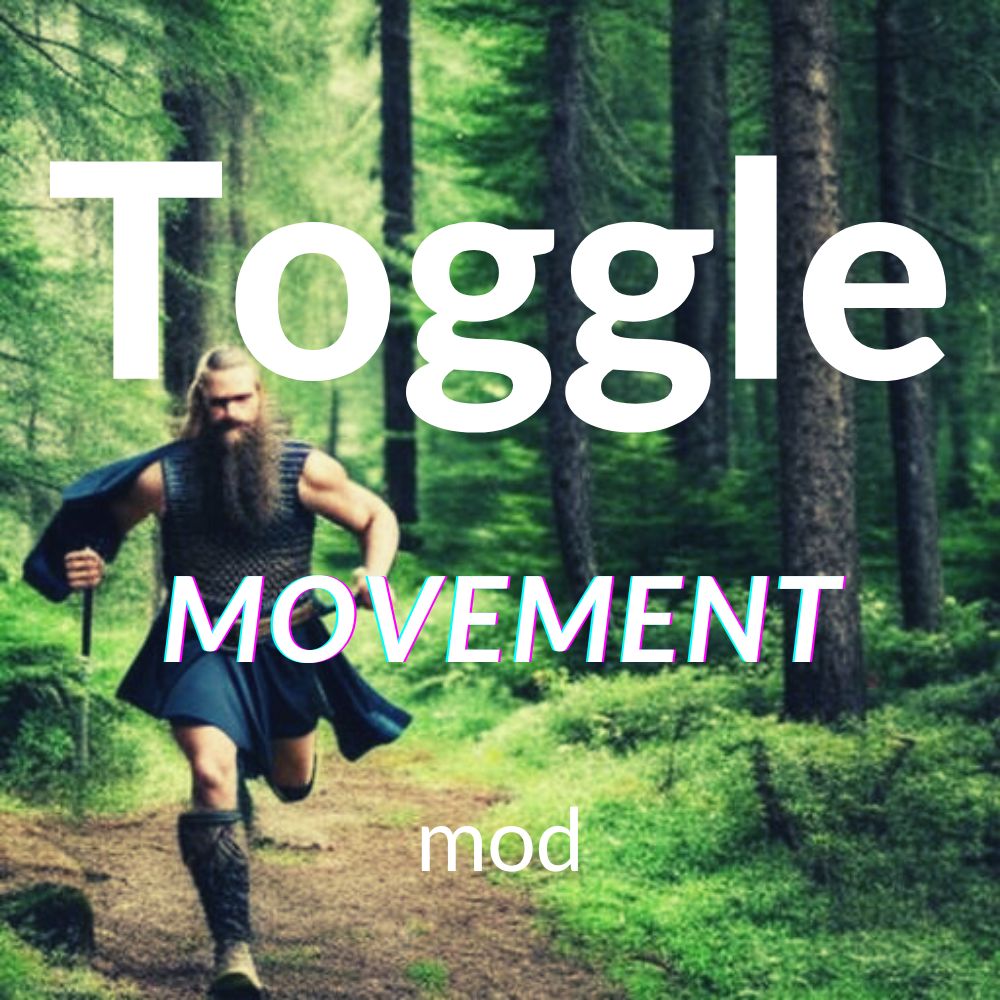

# Valheim - Toggle Movement Mod

**_Works with Mistlands Update!_**

Have you ever played so much Valheim that you injured yourself? Well, I did. When Mistlands released, I bounded over the new and difficult terrain for so many hours mashing my `Shift` key that I experienced what I can only describe as "Valheim pinkie." Basically, I suffered an RSI that forced me to take a break. That's when I knew I needed to make this mod!

## Features

* Sprint (Run) functions as a toggle
* Auto-sneak is now possible
* Auto-run/sneak now follows look direction by default
  * Can be overridden to detach look direction when assigned key is held (default is CapsLock)
* Auto-run while sprinting safeguards stamina regen at threshold (20% by default)
* Auto-sneak while crouching safeguards stamina regen at threshold (20% by default)
* Seamlessly auto-run directly into auto-sneak (and vice versa)
* Jumping doesn't cancel auto-run
* Regain manual control of auto-run/sneak at any time by using directional input
* Fully configurable

## QOL Detail

### Run toggle

No more holding that Run button for hours!

Mistlands requires sprint jumping to effectively scale the jagged terrain. Gorging on high-stamina foods is essentially a requirement, and you need to almost constantly hold your Run key/button in order to get around.

Stock Valheim still hasn't introduced a Run toggle setting, so this mod fixes that by turning your Run key/button into a toggle.

### Seamless auto-run/sneak

This mod allows you to auto-sneak!

Sweating bullets trying to sneak back through the Prairie biome to recover your grave is a unique experience. As you creep forward toward the map marker, frantically attempting to spot nearby enemies, your stamina eventually depletes to zero. And just like that, your character pops out of stealth to attract the receiving end of a Deathsquito's sting. You ruefully hope your "no skill drain" effect lasts a lil longer, right? 

And when you do manage to recover your belongings, you'll have more than ample motivation to maximize your corpse run ability and snap immediately into a full on auto-run.

Stock Valheim auto-run doesn't work while sneaking. If you're crouching and activate auto-run, you pop right up into a walk by default. Similarly auto-running and crouching into sneak will simply disable auto-run.

This mod fixes all that seamlessly, and installs stamina safeguards while auto-running/sneaking.

* The default stamina safeguard is 20%
* When auto-running, you will transition to a walk until stamina fully regenerates 
  * Stamina regen can be overridden if needed by holding your Run key/button
* When auto-sneaking, you will simply stop while crouched until stamina fully regenerates
  * Stamina regen can be overridden if needed by holding your directional input keys while crouching

### Config

The [Official BepInEx ConfigurationManager](https://github.com/BepInEx/BepInEx.ConfigurationManager) is a required dependency.

Configuration allows:

* EnableToggle, Enable the mod, default: true
* SprintToggle, Sprint works like a toggle, default: true
* AutorunOverride, Fixes auto-run to follow look, default: true
* AutorunFreelookKey, Overrides look direction in auto-run while pressed, default: CapsLock
* RunToCrouchToggle, Go from run to crouch with the click of a button, default: true
* StopSneakMovementToggle, Stops sneak movement if no stamina available, default: true 
* MinStamRefillPercent, Percentage to stop running/sneaking and let stamina refill, default: 20%

Built with [BepInEx](https://valheim.thunderstore.io/package/denikson/BepInExPack_Valheim/)

### Releases

Releases in github repo are packaged for Thunderstore Mod Manager.

* 0.0.1 Initial publication
